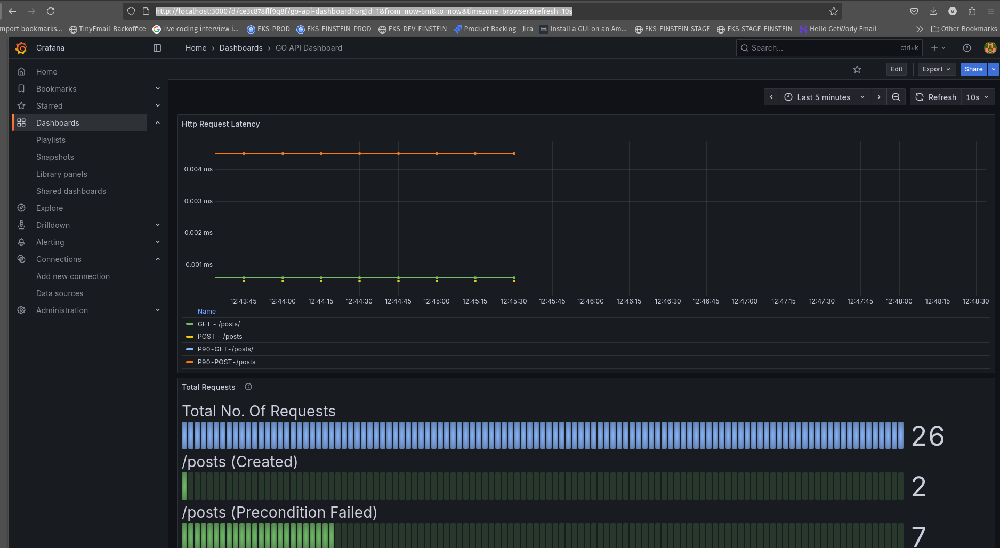

## Description
This is a simple GO Api project that expose REST API for CRUD a post resouce.

More description coming ....

## To Generate mocked repositories
mockgen -source=persistent/repository/repositories.go -destination=persistent/repository/mocks/repositories_mock.go -package=mocks

## Build docker image ##
docker build -t post-rest-app:latest -f ./docker/Dockerfile .

## Start App in Docker ##
docker run -d -p 8080:8080 post-rest-app:latest

## Remove stoped containers
docker container prune

## Run all tests
go test ./...

## Start Docker Compose with Grafana+Prometheus
docker-compose -f docker-compose.yml up -d

## Run API Tests

From api-test run
- posts-create.http to create a post
- posts-get-all.http to receive a list of posts

## Check Grafana Monitoring
Once you start the docker compose it will run

1. Run app on localhsot:8080
2. Prometheus will be scrabing metrics from /metrics endpoint
3. Grafana will generate a basic Dashboard  you can access from `http://localhost:3000/d/ce3c878flf9q8f/go-api-dashboard?orgId=1&from=now-5m&to=now&timezone=browser&refresh=10s`

